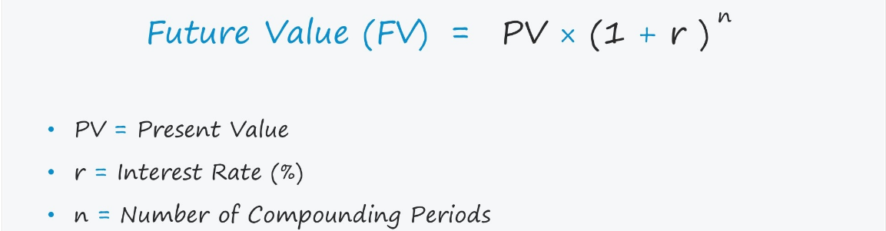

```{r setup, include=FALSE}
knitr::opts_chunk$set(echo = TRUE)
```

# Console R Programming

## arithmetic operations (use R like a calculator)

```{r}
219 + 774 #addition
912 - 1004 #subtraction
23 * 14 # multiplication
21 / 4 # division
2 ^ 6 # power
(2187 + 1144) * (12 - 4) # combination
log(60) # example of a function: log
exp(3) # example of a function: exponent
abs(-364) # example of a function: absolute
350 %% 17 # Mod, remainder after division of 2 numbers.
```

## variable assignments

```{r}
# variable assignment

addition1 <- 219 + 774 ;

# print output to screen

print(addition1)

print(paste("Sum =", addition1))
```


```{r}
# variable assignment

total_weight <- 45
total_area <- 10

density_measure <- total_weight / total_area

# print output to screen
density_measure
```


### remember, variable assignments are case-sensitive


```{r}
amsterdam <- 100

Amsterdam <- 250

AMSTERDAM <- 700

amsterdam + Amsterdam - AMSTERDAM
```

## know your variable types

### numeric

```{r}
# numeric

var1 <- 117.2; var1

class(var1)

typeof(var1)

length(var1)

# print and paste (also, paste0)

print(
  paste(
    "The variable", var1, "is a", class(var1), 
    "variable with a type", typeof(var1), 
    "and a length of", length(var1)
    )
  )
```


### numeric: integer

```{r}
# numeric: integer

var2 <- 77L; var2

class(var2)

typeof(var2)

length(var2)
```


### character

```{r}
# character

var3 <- "A"; var3

class(var3)

typeof(var3)

length(var3)
```

### string

```{r}
# character

var4 <- "BUS 622: Development Tooks in Business Analytics"; var4

class(var4)

typeof(var4)

length(var4)
```

### boolean

```{r}
# boolean

var5 <- TRUE; var5

class(var5)

typeof(var5)

length(var5)

# boolean abbreviations

var5a <- T; var5a

class(var5a)

typeof(var5a)

length(var5a)
```

## vectors

### series of numbers: numeric vector

```{r}
# vector

var6 <- c(1, 2, 3, 5, 8, 13, 21, 34, 55); var6

class(var6)

typeof(var6)

length(var6)
```


### series of strings: character vector

```{r}
# vector

var7 <- c(
  "BUS 622: Development Tooks in Business Analytics", 
  "R Programming", 
  "Python Programming", 
  "MBA", 
  "Baldwin Wallace University"
  ); var7

class(var7)

typeof(var7)

length(var7)
```


### series of boolean values: boolean vector

```{r}
# vector

var8 <- c(TRUE, FALSE, TRUE, FALSE, TRUE); var8

class(var8)

typeof(var8)

length(var8)
```


### more on vectors

#### vector operations

```{r}
# list first 100 numbers - ascending
numList1 <- c(1:100); numList1
```

```{r}
# perform operations on the vector
numList1 + 100
numList1 > 50
```


```{r}
# list first 100 numbers - descending
numList2 <- c(100:1); numList2
```

```{r}
# element-wise addition / multiplication etc.

vec1 <- c(1:10); vec1
vec2 <- c(10:1); vec2

vec1 + vec2 # addition

vec1 * vec2 # multiplication

vec2 / vec1 # division

vec1 ^ vec2 # power
```


#### indexing

```{r}
# vector of letters
letterList1 <- LETTERS ; letterList1
letterList2 <- LETTERS[1:5] ; letterList2
```


```{r}
# indexing
homework_scores <- c(29, 24, 30, 26, 29)

project_pres <- c(34, 40, 33, 38, 33)

project_write <- c(19, 18, 19, 18, 20)
```

```{r}
# What is first element of the Homework vector?
homework_scores[1]
```

```{r}
# What is last element of the Project Writen Report vector?
last_index <- length(project_write)
project_write[last_index]
```

```{r}
# Everything except for the first element of the Project Presentation vector?
project_pres[-1]
```

```{r}
# Second and Third Homework Scores...
homework_scores[2:3]
```

```{r}
# Assign student names to te above score vectors #1
names(homework_scores) <- c("Emily", "Will", "Ryan", "Sierra", "Maher")

names(project_pres) <- c("Emily", "Will", "Ryan", "Sierra", "Maher")

names(project_write) <- c("Emily", "Will", "Ryan", "Sierra", "Maher")
```

```{r}
# What is Maher's Homework Score?
homework_scores["Maher"]
```

```{r}
# What is Emily's Total Score?
homework_scores["Emily"] + project_pres["Emily"] + project_write["Emily"]
```

```{r}
# What is Will's, Ryan's and Sierra's Project Presentation scores?
project_pres[c("Will", "Ryan", "Sierra")]
```

```{r}
# Who earned full Homework score?
full_hw_score <- homework_scores == 30
homework_scores[full_hw_score]
```


```{r}
# Assign student names to te above score vectors #2
full_names <- c("Emily Muench", "Will Bolin", "Ryan Rivera", "Sierra Wick", "Maher Ahmad")

names(homework_scores) <- full_names

names(project_pres) <- full_names

names(project_write) <- full_names
```

```{r}
# What is Project Writen Report score for Will Bolin?
project_write["Will Bolin"]
```

```{r}
# What is total Project Presentation score for the class?
sum(project_pres)
```

```{r}
# ... same as 
project_pres[1] + project_pres[2] + project_pres[3] + project_pres[4] + project_pres[5]
```

```{r}
# ... same as
project_pres["Emily Muench"] + project_pres["Will Bolin"] + project_pres["Ryan Rivera"] + project_pres["Sierra Wick"] + project_pres["Maher Ahmad"]
```

```{r}
# What is the mean, min, and max Homework Score for the class?
mean(homework_scores)

min(homework_scores)

max(homework_scores)

sd(homework_scores)
```

```{r}
# Did the class score in the Homework or in the Project?
sum(homework_scores) > sum(project_pres) + sum(project_write)
```

```{r}
# Did the class score in the Homework or in the Project?
# assign and fancy it
check <- sum(homework_scores) > sum(project_pres) + sum(project_write)
      
ifelse(
  check == TRUE,
  "Class scored more in the Homeworks than in the Project.",
  "Class scored more in the Project than in the Homeworks."
  )
```


## relational and logical operators: 
## >, <, ==, <=, >=, &, |, !=

```{r}
num1 <- 100
num2 <- 200
num3 <- 100
```

```{r}
# greater than
num1 > num2
```

```{r}
# less than
num1 < num2
```

```{r}
# greater than or equal to
num1 >= num3
```

```{r}
# less than or equal to
num3 <= num2
```

```{r}
# equal to
num1 == num3
```

```{r}
# not equal to
num1 != num2 # (or) !(num1 == num2)
```

```{r}
# AND operator
num1 < num2 & num1 <= num3
```

```{r}
# OR operator
num1 == num2 | num1 == num3
```

```{r}
# compound operations
num1 + num3 == num2
```

## factor operators

```{r}
# educational classification
edu_class <- c("HS", "UG", "MBA", "HS", "MBA", "UG",
               "HS", "HS", "UG", "MA", "MBA", "HS", 
               "UG", "MA", "UG", "MA", "MA", "MBA")
```

```{r}
# convert edu_class to a factor
factor_edu_class <- factor(edu_class)
factor_edu_class
```

```{r}
# convert edu_class to a factor with levels
factor_edu_class1 <- factor(edu_class, order = TRUE, levels = c("HS", "UG", "MA", "MBA"))
factor_edu_class1
```

```{r}
# summary
summary(factor_edu_class1)
```


```{r}
# is someone more qualified than another? 
factor_edu_class1[5]
factor_edu_class1[9]

factor_edu_class1[5] > factor_edu_class1[9]
```

## simple computations

### e.g., Celsius to Fahrenheit conversion


```{r}
# Celsius to Fahrenheit conversion

tempCelsius <- 40

tempFahrenheit <- (tempCelsius * 1.8) + 32 

print(tempFahrenheit)

```


### e.g., Fahrenheit to Celsius conversion


```{r}
# Fahrenheit to Celsius conversion

tempFahrenheit <- c(55:70)

tempCelsius <- (tempFahrenheit - 32) * 5/9 

print(tempCelsius)

```

### Rounding

```{r}
# rounding to the nearest 2 decimal places

round(tempCelsius, digits = 2)
```

### Floor

```{r}
# rounding to the lowest integer

floor(tempCelsius)
```

### Ceiling

```{r}
# rounding to the highest integer

ceiling(tempCelsius)
```

### e.g., compute Future Value

 

```{r}
int <- 0.08 # 8% annual rate

nterms <- 7 # number of years

amount <- 1000 # present value
```

```{r}
# compute future value
fv <- amount * ((1 + int)^nterms); fv
```

```{r}
# modular calculation

fv1 <- (1 + int)^nterms;

fv1 <- fv1 * amount; fv1
```

### e.g., compute Future Value for a vector of interest rates

```{r}
int1 <- c(0.06, 0.08, 0.10, 0.12); int1 
```

```{r}
# compute future value
fv2 <- amount * ((1 + int1)^nterms); fv2
```

## convert vector to a dataframe

```{r}
# convert vector to a dataframe
df <- data.frame(number = c(1:100)) ; head(df)
```

```{r}
# add variables
df$gt50 <- df$number > 50
df$bt20_40 <- as.factor(df$number >= 20 & df$number <= 40)
df$div2 <- ifelse(df$number%%2 == 0, TRUE, FALSE)

str(df$gt50)
str(df$bt20_40)
```

```{r}
full_names <- c("Emily Muench", "Will Bolin", 
                "Ryan Rivera", "Sierra Wick", 
                "Maher Ahmad")
comp_spec <- c("Mac", NA, "PC", NA, "PC")
random_ques <- c(FALSE, FALSE, TRUE, TRUE, TRUE)
homework_scores <- c(29, 24, 30, 26, 29)
project_pres <- c(34, 40, 33, 38, 33)
project_write <- c(19, 18, 19, 18, 20)

# Create a data frame from the vectors
df1 <- data.frame(full_names, comp_spec, random_ques, 
                  homework_scores, project_pres, project_write)
View(df1)
```

### dataframe operations

```{r}
# subset
subset(df1, homework_scores > 26)
```

```{r}
# subset
subset(df1, homework_scores > 26 & project_write < 20 & comp_spec == "Mac")
```


```{r}
# sorting (order)
sorting_order_asc <- order(df1$project_pres)
sorting_order_asc
```


```{r}
# sort the dataframe (asc)
df1[sorting_order_asc,]
```


```{r}
# sorting (order)
sorting_order_desc <- -1 * order(df1$project_pres)
sorting_order_desc
```

```{r}
# sort the dataframe (desc)
df1[order(sorting_order_desc),]
```


## use in-built datasets

```{r}
# first load datasets package
library("datasets")
```


```{r}
# pick a dataset
# and read its documentation
help(iris) 
```

```{r}
# glimpse of the dataset
head(iris, 2)
tail(iris, 5)
```


```{r}
# describe the dataset: structure
str(iris)
```

```{r}
# create local variables of variables inside the dataset
sepalLength <- iris$Sepal.Length
```

```{r}
# manipulate variables inside the dataset
iris$Sepal.LogLength <- log(iris$Sepal.Length)
```

***


# Console Python Programming

## arithmetic operations (use Python like a calculator in Jupyter Notebook)

```{python}
219 + 774 #addition
912 - 1004 #subtraction
23 * 14 # multiplication
21 / 4 # division
21 // 4 # floor division
2 ** 6 # power
pow(2, 6) # example of a function: power
(2187 + 1144) * (12 - 4) # combination
```

***
